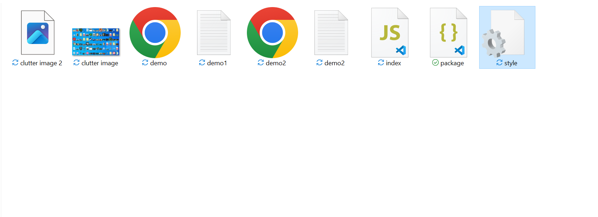
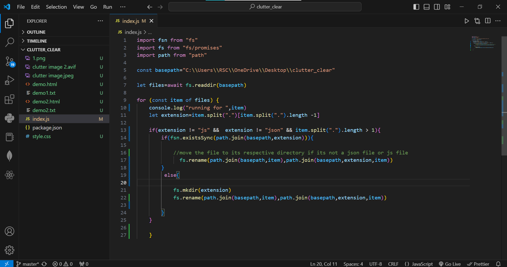
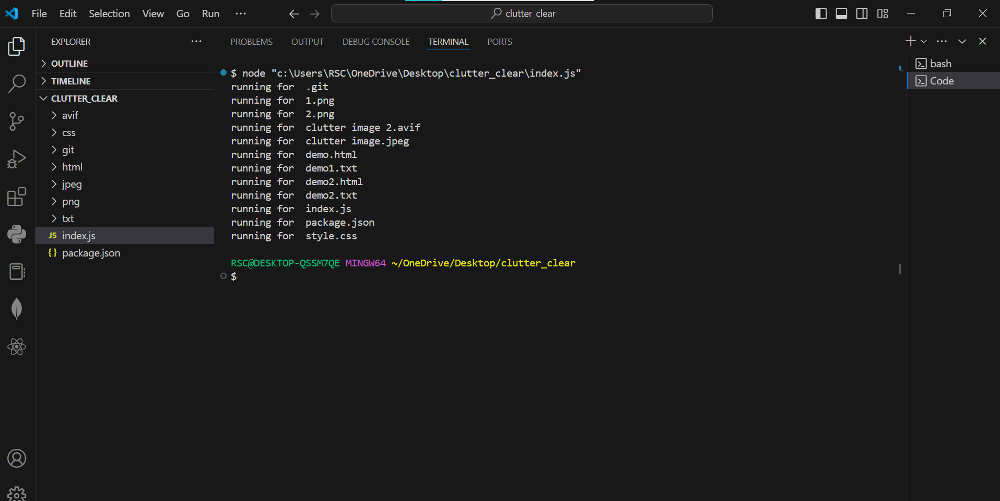
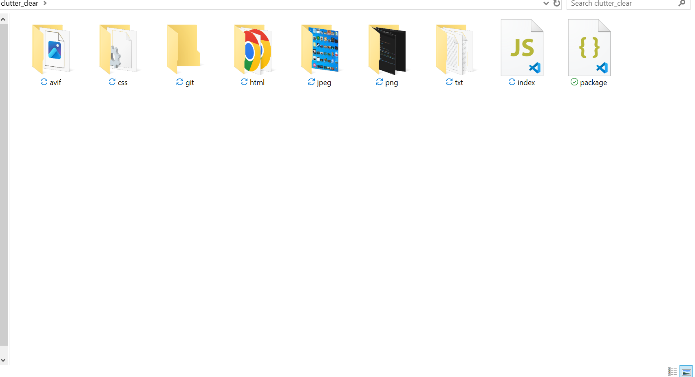

This is a simple Node.js project which is used to clear the clutter and messed up files from folder.With this simple code , we can get all files in different folders depending on the type of file it is (based on its extension)

